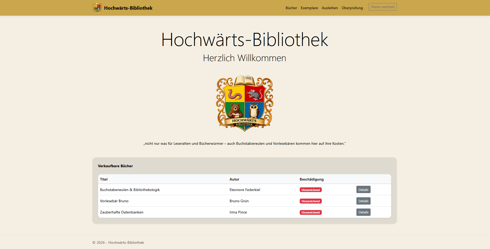
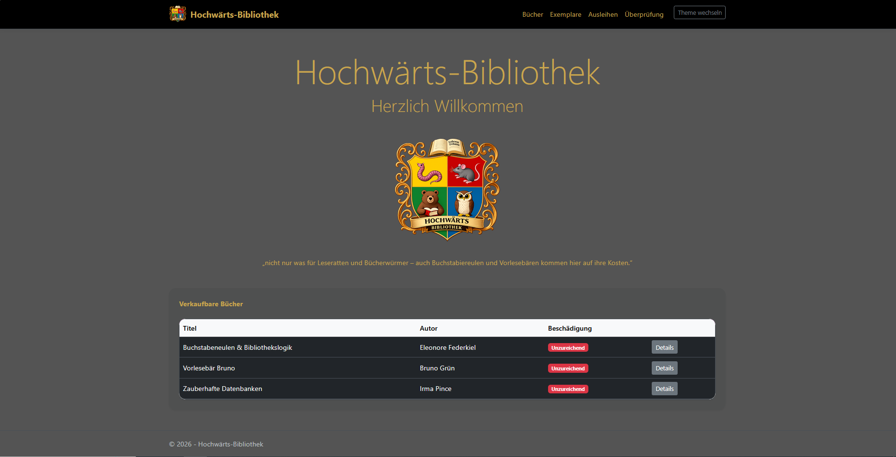
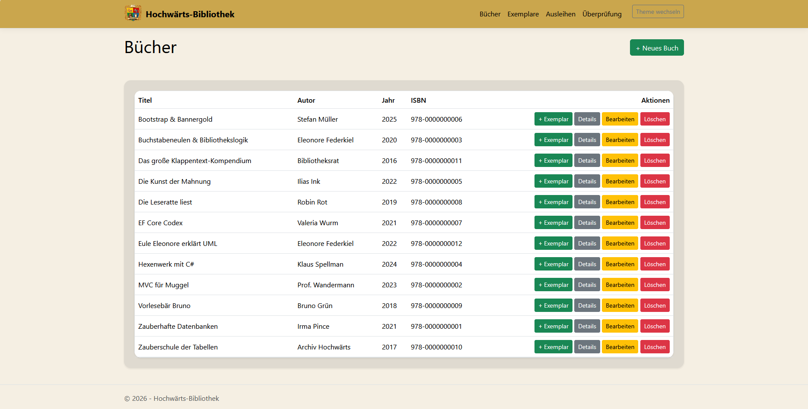
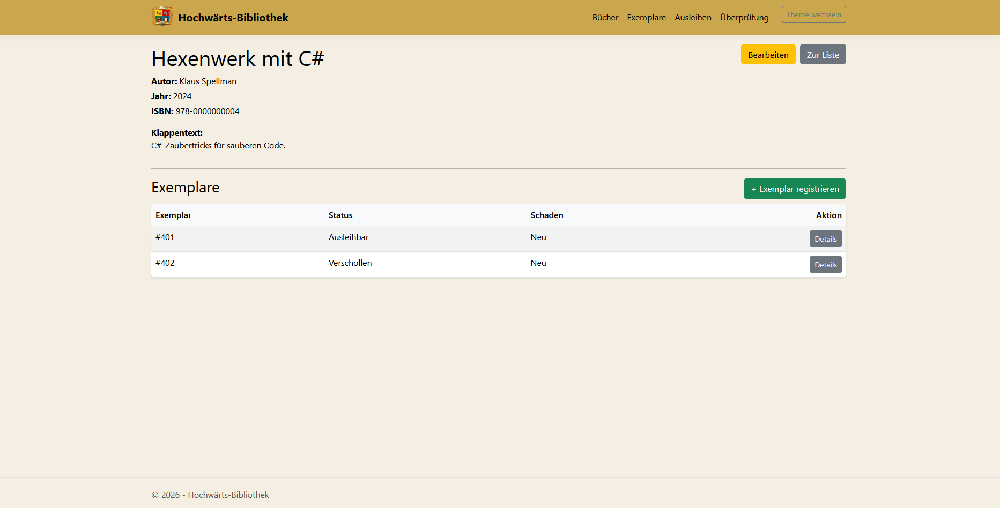
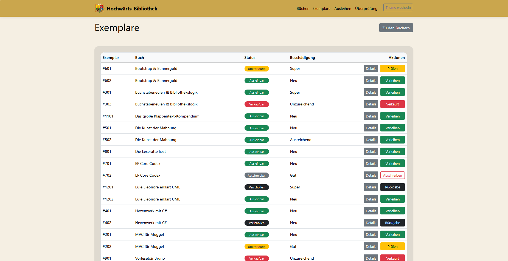
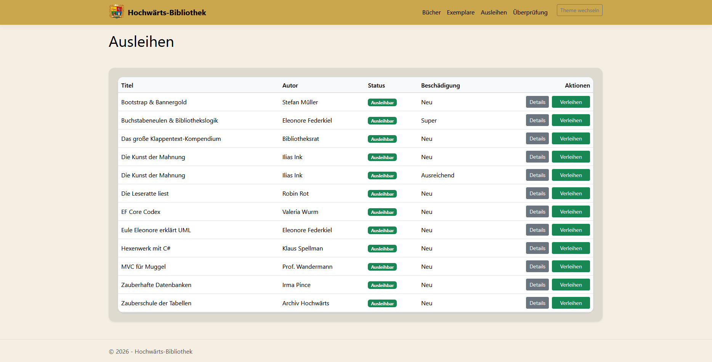
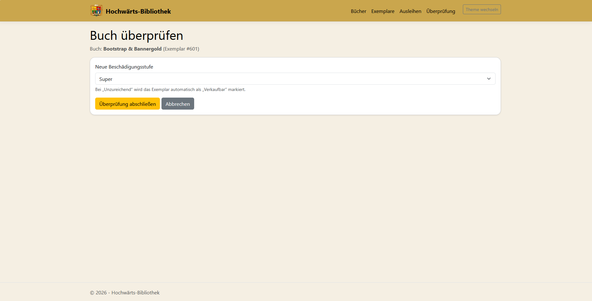

# Bibliotheksverwaltung der Hochwärts-Bibliothek

Eine webbasierte Bibliotheksverwaltung, entstanden im Rahmen meiner Umschulung zum Fachinformatiker für Anwendungsentwicklung.

Das Projekt bildet typische Abläufe einer Bibliothek ab – von der Erfassung neuer Bücher über die Verwaltung einzelner Exemplare bis hin zu Ausleihe, Rückgabe, Zustandsprüfung und Verkauf beschädigter Bücher.

## Projektidee

Ein Buch kann mehrfach in der Bibliothek vorhanden sein. Deshalb wird zwischen Buch und Exemplar unterschieden:

- Buch = allgemeine Informationen wie Titel, Autor, ISBN und Beschreibung
- Exemplar = das konkrete physische Buch mit eigenem Zustand und Status

Dadurch lässt sich jedes Exemplar einzeln verwalten.

## Funktionen

- Bücher anlegen, bearbeiten und löschen
- Bücher zu Exemplaren registrieren
- Exemplare verleihen und zurücknehmen
- automatische Mahnstufen nach 30, 60 und 90 Tagen
- automatische Markierung als verschollen nach mehrfacher Mahnung
- nach einem Jahr verschollen automatisch als abschreibbar markiert
- Zustandsprüfung nach Rückgabe
- beschädigte Exemplare werden automatisch als verkaufbar markiert
- verkaufbare Bücher werden auf der Startseite angezeigt
- Light- und Dark-Theme

## Verwendete Technologien

- C#
- ASP.NET Core MVC
- Entity Framework Core
- SQL Server LocalDB
- Razor Views
- Bootstrap 5
- CSS

## Technische Umsetzung

Die Anwendung wurde mit einer klaren Trennung zwischen Model, View und Controller aufgebaut.

Enthalten sind unter anderem:

- Datenmodell mit Beziehungen zwischen Buch, Exemplar und Ausleihe
- Entity Framework Core für Datenbankzugriffe
- BackgroundService für automatische Status- und Mahnlogik
- serverseitige Validierung mit Data Annotations
- dynamischer Theme-Wechsel über Cookies
- responsive Oberfläche mit Bootstrap

## Statuslogik

Ein Exemplar durchläuft je nach Verlauf verschiedene Zustände:

Ausleihbar → Verliehen → Überprüfung → Ausleihbar

oder bei starkem Verschleiß:

Ausleihbar → Verliehen → Überprüfung → Verkaufbar

bei Verlust:

Ausleihbar → Verliehen → Verschollen → Abschreibbar

Dadurch entsteht ein nachvollziehbarer Lebenszyklus für jedes Exemplar.

## Screenshots

### Startseite

### Startseite (Dark Mode)

### Bücherübersicht

### Buchdetails

### Exemplare

### Ausleihen

### Überprüfung

## Installation

Projekt klonen:

git clone https://github.com/Steffen-Schmitt-dev/Hochwaerts-Bibliothek.git

Danach in Visual Studio öffnen und starten.

Beim ersten Start wird die Datenbank über Entity Framework erstellt.

## Hintergrund

Dieses Projekt entstand im Rahmen meiner Umschulung und diente dazu, praktische Erfahrung mit ASP.NET Core MVC, Entity Framework Core und relationaler Datenmodellierung zu sammeln.
